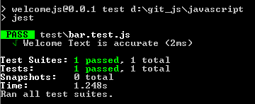
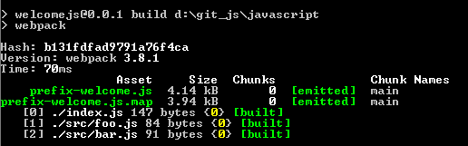
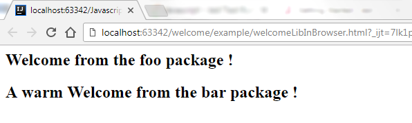

# Welcome Library

## Introduction

The `welcome` Library is a minimal (getting started) javascript library that will welcome you from two modules.


The story (or blog) over this repository can be found here:

  * [Javascript - Getting Started - How to develop, publish and use a library ?](https://gerardnico.com/wiki/lang/javascript/library_build)

This repository will build a library:
  * exposed as the global variable `welcome`
  * saved in the file `prefix-welcome.js`
  * aggregating two modules (`foo` and `bar`)
  * testing a method

The tool used are:
  * `npm` for the module dependency
  * `WebPack` as builder.
  * [Jest](https://facebook.github.io/jest/) as test runner
  
## Output 

The output from the browser or from Node will be 
```text
Welcome from the foo package !
A warm Welcome from the bar package !
```

## Usage of the Git Repository

  * [Install Node](https://nodejs.org/en/)
  * Clone this repository
```bash
git clone https://github.com/gerardnico/welcomejs
```
  * Execute a `npm install`
  * Execute a `npm run test` to execute the test with Jest through `npm`
```bash
npm run test
```

  * Execute a `npm run build` to build the library `prefix-welcome.js` in the directory `dist`
```bash
npm run build
```

  
  * Run the examples given in the usage section below.
  
  

## Usage of the final library with examples

### Node
See the file [welcomeLibInNode.js](./example/welcomeLibInNode.js)
```javascript
var welcome = require("../dist/prefix-welcome");
console.log(welcome.foo());
console.log(welcome.bar());
```

  * Run it 
```bash
C:\welcome\example>node welcomeLibInNode.js
```
  * Output:
```text
Welcome from the foo package !
A warm Welcome from the bar package !
```

### Browser

See the file [welcomeLibInBrowser.html](./example/welcomeLibInBrowser.html)
```html
<html>
<!--
If published in Node
<script src="https://unpkg.com/myLisbrary"></script>
Otherwised locally
-->
<script src="../dist/prefix-welcome.js"></script>
<body>
</body>
<script>
    // Global variable
    var welcomeFoo = welcome.foo();
    // Property in the window object
    var welcomeBar = window.welcome.bar();
    document.body.innerHTML = "<h2>"+welcomeFoo+"</h2><h2>"+welcomeBar+"</h2>";
</script>
</html>
```

* Run it:




## Note on dependency

Note on the`npm` configuration file `package.json`:

  * `Babel` has been added to be able to use the `import` statement with the `jest` test framework. `jest` is a node process and actually understand only `require`
  * `Webpack 2` understands natively the `import` statement. 

## Git 
  * `package-lock.json` should be versionned. npm create it. It's a lockfile that is automatically generated for any operations where npm modifies either the node_modules tree, or package.json. It describes the exact tree that was generated, such that subsequent installs are able to generate identical trees, regardless of intermediate dependency updates.